# cc-sdd-custom

A fork of [gotalab/cc-sdd](https://github.com/gotalab/cc-sdd) (v3 Skills-mode) with one addition: an optional **intent-exploration** front door for genuinely vague ideas. Everything else mirrors upstream.

---

## What this fork is

Upstream cc-sdd v3 is a spec-driven development system for Claude Code, built on 17 skills that progress an idea from **discovery → specs (requirements/design/tasks) → autonomous TDD implementation**. It assumes you start with a clear-enough idea to feed `/kiro-discovery`.

This fork adds:

1. **`kiro-intent` skill** — a deliberate pre-discovery step that delegates to a global `intent-explorer` skill (JTBD + first-principles + cross-pollination methodology). Use it when the problem framing is unclear, not on every feature.
2. **A 5-line patch on `kiro-discovery`** — its Step 1 globs for `intent-spec.md`; its Step 4 reads that file and skips the questions it already answers. Non-breaking: with no intent-spec.md present, `kiro-discovery` runs identically to upstream.

Everything else — the other 16 skills, all rules, all spec/steering templates — is byte-identical to upstream v3.

---

## Workflow

```mermaid
flowchart LR
    Idea -->|vague?| Intent["/kiro-intent"]
    Idea -->|clear?| Discovery["/kiro-discovery"]
    Intent -->|writes intent-spec.md| Discovery
    Discovery -->|brief.md / roadmap.md| SpecInit["/kiro-spec-init"]
    SpecInit --> Requirements["/kiro-spec-requirements"]
    Requirements --> Design["/kiro-spec-design"]
    Design --> Tasks["/kiro-spec-tasks"]
    Tasks --> Impl["/kiro-impl<br/>(autonomous TDD)"]
    Impl --> Validate["/kiro-validate-impl"]

    style Intent fill:#4a3,stroke:#333,color:#fff
    style Discovery fill:#38a,stroke:#333,color:#fff
    style SpecInit fill:#38a,stroke:#333,color:#fff
    style Requirements fill:#38a,stroke:#333,color:#fff
    style Design fill:#38a,stroke:#333,color:#fff
    style Tasks fill:#38a,stroke:#333,color:#fff
    style Impl fill:#a33,stroke:#333,color:#fff
    style Validate fill:#a83,stroke:#333,color:#fff
```



**Routing principle**: `kiro-discovery` is the official entry point. `kiro-intent` is an optional upstream filter that activates only when the user opts in (it has `disable-model-invocation: true` — Claude won't auto-trigger it).

---

## Installation

### 1. Copy this fork into your project

```bash
cp -r workflows/cc-sdd-custom/.claude/skills/ <your-project>/.claude/
cp -r workflows/cc-sdd-custom/.kiro/ <your-project>/
```

This drops 18 skills (17 upstream + `kiro-intent`) and the spec/steering templates into your project.

### 2. Install the `intent-explorer` global skill (only if you want `kiro-intent`)

`kiro-intent` is a delegate — the methodology lives in the global `intent-explorer` skill. Install it at `~/.claude/skills/intent-explorer/`. Without it, `kiro-intent` will surface a clear "dependency missing" message; the rest of the workflow keeps working.

If you skip this, run `/kiro-discovery` directly — discovery will still ask its own user-need questions, just less deeply.

### 3. Bootstrap steering documents (recommended for existing projects)

```
/kiro-steering
```

Creates `.kiro/steering/{product,tech,structure}.md` from your codebase. These act as project memory across all spec phases.

---

## Skills

Skills auto-trigger on relevant context unless marked **explicit-only**. The two explicit-only skills are flow controllers — they wait for you to call them.

### Discovery & intent

| Skill                  | Type            | Purpose                                                                                                                      |
| ---------------------- | --------------- | ---------------------------------------------------------------------------------------------------------------------------- |
| `/kiro-intent`         | explicit-only   | Optional. Delegates to `intent-explorer` for vague ideas. Writes `intent-spec.md` for `kiro-discovery` to pick up.           |
| `/kiro-discovery`      | explicit-only   | Routes new work: extend existing spec, no spec needed, single new spec, multi-spec decomposition, or mixed.                  |

### Spec phase

| Skill                       | Purpose                                                                                |
| --------------------------- | -------------------------------------------------------------------------------------- |
| `/kiro-spec-init`           | Initialize spec scaffold for one feature.                                              |
| `/kiro-spec-quick`          | Fast-path single-spec generation, skipping deep validation.                            |
| `/kiro-spec-batch`          | Parallel multi-spec generation by dependency wave (reads `roadmap.md`).                |
| `/kiro-spec-requirements`   | EARS-format requirements from project description + steering.                          |
| `/kiro-spec-design`         | Technical design with discovery, file structure plan, and boundary annotations.        |
| `/kiro-spec-tasks`          | Implementation tasks with `_Boundary:_` and `_Depends:_` metadata.                     |
| `/kiro-spec-status`         | Progress dashboard for any spec.                                                       |

### Validation

| Skill                       | Purpose                                                                                |
| --------------------------- | -------------------------------------------------------------------------------------- |
| `/kiro-validate-gap`        | Analyze implementation gap vs existing codebase before designing.                      |
| `/kiro-validate-design`     | Interactive design quality review before implementation.                               |
| `/kiro-validate-impl`       | Cross-task consistency + full test suite check after all tasks land.                   |
| `/kiro-verify-completion`   | Fresh-evidence gate before claiming a task is done.                                    |

### Implementation

| Skill                       | Type            | Purpose                                                                                |
| --------------------------- | --------------- | -------------------------------------------------------------------------------------- |
| `/kiro-impl`                | explicit-only   | Autonomous TDD loop with implementer + reviewer + debug subagents per task.            |
| `/kiro-debug`               | auto            | Root-cause-first investigation when an implementer is blocked or convergence stalls.   |
| `/kiro-review`              | auto            | Independent task review against spec, boundary, and verification evidence.             |

### Steering

| Skill                       | Purpose                                                                                |
| --------------------------- | -------------------------------------------------------------------------------------- |
| `/kiro-steering`            | Bootstrap or sync `.kiro/steering/` (product, tech, structure).                        |
| `/kiro-steering-custom`     | Add custom steering files for specialized contexts (security, API standards, etc.).    |

---

## What changed vs upstream cc-sdd v3.0.2

- **Added**: `.claude/skills/kiro-intent/SKILL.md` (delegate skill, ~30 lines)
- **Patched**: `.claude/skills/kiro-discovery/SKILL.md` Step 1 (1-line glob for `intent-spec.md`) and Step 4 (one paragraph: skip questions already answered by intent-spec)
- **Dropped**: legacy v2 commands (`.claude/commands/kiro/*`) and the `.kiro/settings/rules/` folder. Rules are now co-located with the skills that use them — that is upstream v3 architecture, not a custom choice.

The patches are small enough that re-syncing with upstream takes ~5 minutes per release.

### What was NOT changed

- All 16 stock skills (byte-identical to v3.0.2)
- All rule files (12 rules, distributed across the skills that own them)
- Spec templates (`requirements.md`, `design.md`, `tasks.md`, `requirements-init.md`, `init.json`, `research.md`)
- Steering templates (3 default + 7 custom)

---

## How `kiro-discovery` uses `intent-spec.md`

When you run `/kiro-discovery '<idea>'` after `/kiro-intent` has produced an `intent-spec.md`:

- **Step 1** (Lightweight scan) globs `.kiro/specs/*/intent-spec.md` and notes any matches alongside the regular `spec.json` inventory.
- **Step 4** (Understand the idea) checks whether a matching `intent-spec.md` exists. If yes:
  - It reads the file as context (user-need, problem statement, outcomes, verification — already covered).
  - It skips questions 1 (Who and why), 2 (Desired outcome), and 7 (Constraints).
  - It still asks questions 3, 4, 5, 6 (boundary, out-of-boundary, existing-vs-new, upstream/downstream) — those are kiro-discovery's unique value.
  - It tells the user which intent-spec was loaded so the skip is transparent.

If no `intent-spec.md` is present, `kiro-discovery` runs unchanged from upstream v3.

---

## Updating from upstream

```bash
# In a scratch directory:
npm exec --yes -- cc-sdd@latest --claude-skills

# Then diff against this fork to see what changed:
diff -r /tmp/scratch/.claude/skills/ workflows/cc-sdd-custom/.claude/skills/
```

The two patches on `kiro-discovery` are the only places upstream merge conflicts can land. Everything else is overwrite-safe.

---

## License

This fork inherits the MIT License from upstream cc-sdd. See [LICENSE](./LICENSE).
